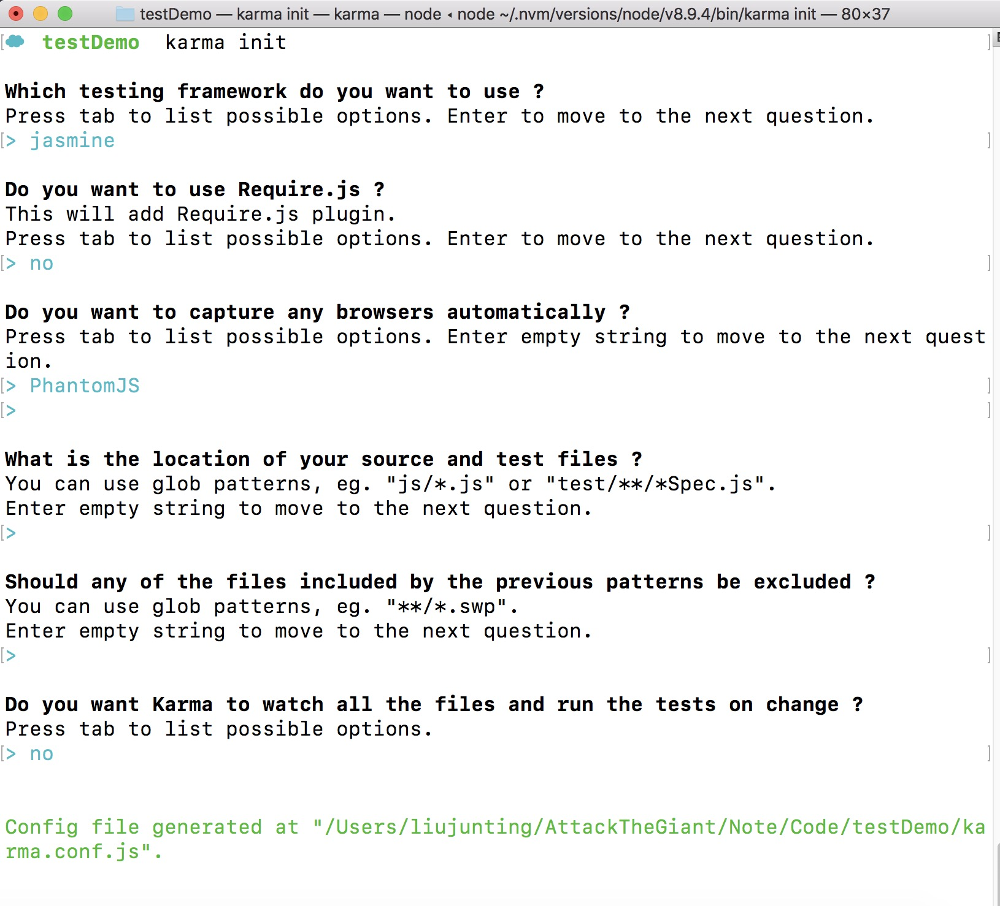
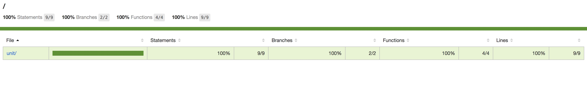
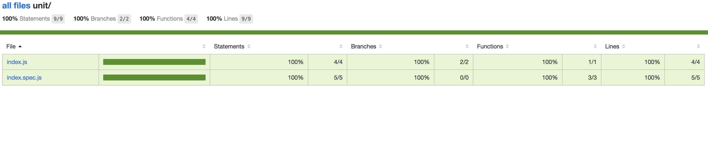
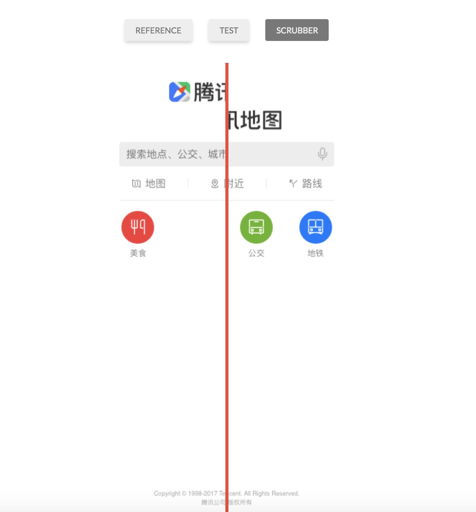

# JavaScript & QA工程师

# 单元测试

## 步骤一

**使用NPM管理项目依赖工具包**

```
# 初始化项目
$ npm init -y

```

## 步骤二

**安装 karam 测试工具**

> 集成化测试环境: 集成浏览器 & 断言库

```
# 项目安装或全局安装 karam
$ npm install karma --save-dev  (npm install karma -g)

# 命令行界面 (识别karam命令,不需要访问到安装包执行启动命令)
$ npm install karma-cli --save-dev (npm install -g karma-cli)

# 安装项目中需要的工具
$ npm install karma-jasmine karma-chrome-launcher jasmine-core --save-dev

# 初始化项目
$ karma init

# 启动karma
$ karma start

# 安装 PhantomJS 虚拟浏览器,无界面的命令行客户端; 不会自带安装,不然会包一个错
$ npm install karma-phantomjs-launcher --save-dev


```



## 步骤三

**测试代码覆盖率: 安装 coverage**

```karma-coverage

# 安装 karma-coverage
$ npm install karma-coverage --save-dev
```

[安装 coverage 还需要哪些配置](https://www.npmjs.com/package/karma-coverage?activeTab=readme)

**测试图**




以上三步走完,基本的一个单元测试就算有了基本了解,算是跨入了了测试的大门,剩下的就是多练习,慢慢深入进去了!

# e2e 测试 (功能测试)

> e2e -> 端对端的测试 -> 自动化测试

来一个需求: Chrome 浏览器输入 `www.baidu.com`, 百度搜索输入词 `node` 回车,下一个页面的标题为 “node_百度搜索“.

我们来通过这个例子进行对 `e2e 测试` 的一个了解;

## 步骤一

**安装工具: selenium-webdriver**

[文档](https://www.npmjs.com/package/selenium-webdriver)

```
# 安装工具
$ npm install selenium-webdriver --save-dev

# 配置下 package.json, 执行 e2e 脚本的命令

  "scripts": {
    "test": "echo \"Error: no test specified\" && exit 1",
    "e2e": "node ./e2e/*.js"
  },

$ npm run e2e

# 运行过程中 我们就能看到自动模拟的效果了
```
以上做完,移步到 `e2e` 目录下,看下这个🌰

# UI测试

自己做的页面与 UI 原型设计图进行自动化对比精确到1个像素.模拟测试交互效果下的UI展现.

**工具: BackstopJS**

BackstopJs 是对 Casper 的封装;

[文档](https://github.com/garris/BackstopJS)

```
# 全局安装 (只安转在本项目下,需要到安装目录下执行命令)
$ npm install -g backstopjs

# 初始化,会在根目录下生成配置文件 backstop.json 和 测试数据文件夹 backstop_data
$ backstop init

# 执行测试
$ backstop test

```

解读下 `backstop.json` 文件

```
        {
  "id": "backstop_UI测试",
  # 响应 Tables
  "viewports": [
    {
      "label": "phone",
      "width": 375,
      "height": 667
    },
    {
      "label": "tablet",
      "width": 1024,
      "height": 768
    }
  ],
  "onBeforeScript": "chromy/onBefore.js",
  "onReadyScript": "chromy/onReady.js",
  "scenarios": [
    {
      "label": "qqMap",   // 项目标签
      "cookiePath": "backstop_data/engine_scripts/cookies.json", // cookie 地址
      "url": "https://map.qq.com/m/",    // 项目地址
      "referenceUrl": "",
      "readyEvent": "",
      "readySelector": "",
      "delay": 0,
      "hideSelectors": [],
      "removeSelectors": [],
      "hoverSelector": "",
      "clickSelector": "",
      "postInteractionWait": 0,
      "selectors": [],
      "selectorExpansion": true,
      "misMatchThreshold" : 0.1,
      "requireSameDimensions": true
    }
  ],
  # 生成后的图像、报表
  "paths": {
    "bitmaps_reference": "backstop_data/bitmaps_reference",     // 原型图参考
    "bitmaps_test": "backstop_data/bitmaps_test",           // 测试生成的文件
    "engine_scripts": "backstop_data/engine_scripts",   // 引擎
    "html_report": "backstop_data/html_report",      // 报表
    "ci_report": "backstop_data/ci_report"        // ci 报表
  },
  "report": ["browser"],
  "engine": "chrome",
  "engineFlags": [],
  "asyncCaptureLimit": 5,
  "asyncCompareLimit": 50,
  "debug": false,
  "debugWindow": false
}

```

**注意**

* bitmaps_reference 中存放的UI原型设计图格式png
* 名称得对应你配置的规则, 先执行一遍,然后就可以发现命名的规则了
* 名称规则: `backstop_UItest_QQ_Map_0_document_0_phone.png`, 结合你的配置规则

**测试图**




# 性能测试

代码性能测试,这里使用这个库 `Benchmark.js`(基准库)，支持高分辨率计时器并返回统计显着结果。

[文档](https://github.com/bestiejs/benchmark.js/)

```
# 安装
$ npm install benchmark --save-dev

# 配置下 package.json, 执行代码测试脚本的命令

  "scripts": {
    "test": "echo \"Error: no test specified\" && exit 1",
    "e2e": "node ./e2e/*.js",
    "permance": "node ./permance/*.js"
  },

$ npm run permance

```
